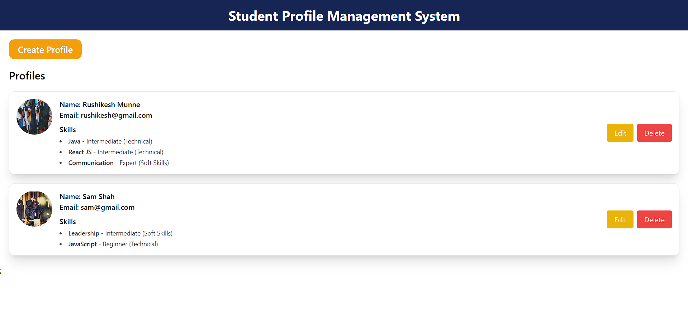
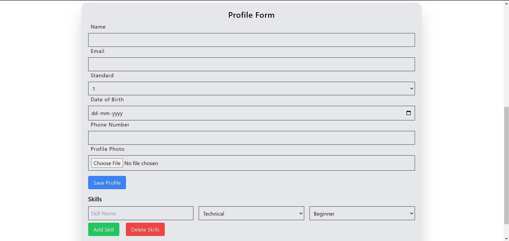
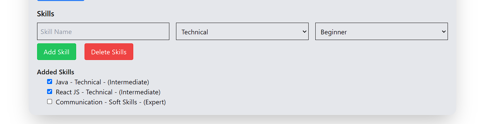

# Profile Form Application

## Description
This is a React-based Student Profile Form Application that allows users to create and manage their profiles. Students can input personal information like Name, Email, Standard, Date of Birth, Phone Number, and upload a Profile Photo. The application also supports skill management, where users can add, categorize, and delete skills.

The main features of the application include:
- Form to create and edit user profile.
- Add and categorize skills with different proficiency levels.
- Mark skills as selected for deletion and delete them in bulk.
- Save and update profile information.

## Features
- **Create Profile**: The user can create a profile by providing their personal information (Name, Email, Date of Birth, etc.).
- **Skill Management**: The user can add skills to their profile, choose the category (Technical, Soft Skills, Others), and select the proficiency level (Beginner, Intermediate, Expert).
- **Delete Selected Skills**: The user can mark skills for deletion and remove the selected skills from the list.
- **File Upload**: Users can upload a profile photo.
- **Responsive Design**: The application is designed to be responsive across multiple devices.

## Setup Instructions

To set up the project locally, follow these steps:

### Prerequisites
- Node.js (v14 or higher)
- npm (Node Package Manager)

### Steps to Run Locally

1. **Clone the repository**
   ```bash
   git clone https://github.com/rushikeshmunne10/student-profile-management.git
   ```

2. **Navigate into the project directory**
   ```bash
   cd profile-form-app
   ```

3. **Install Dependencies**
   ```bash
   npm install
   ```

4. **Start the development Server**
   ```bash
   npm start
   ```

5. **Open your browser and go to http://localhost:3000 to view the application.**

## Built with
1. **React.js**: JavaScript library for building user interfaces.
2. **Tailwind CSS**: Utility-first CSS framework for designing responsive layouts.
3. **React Hooks**: Used for managing state and side effects in the components.

## Challenges Faced

### 1. **Controlled and Uncontrolled Inputs Warning**
   One of the significant challenges faced was managing the form inputs correctly to avoid React's warning about "changing a controlled input to an uncontrolled one". This happened when an input field's value was initially set, but later it was changed to `undefined` or null due to state management issues. The solution was to ensure that all inputs had a proper fallback value, particularly when data was not available, preventing them from being uncontrolled.

### 2. **State Management for Dynamic List (Skills)**
   Handling the state for the dynamic list of skills proved to be challenging. The `currentProfile.skills` array had to be updated correctly when the user interacted with checkboxes to select or deselect skills. Managing these updates without overwriting existing skills was tricky. Using the `map` function to iterate over the skill list and updating individual skill objects based on the selected index helped resolve this issue.

### 3. **Dealing with Undefined or Missing Data**
   There were several cases where `currentProfile.skills` or other fields like `currentProfile` itself could be undefined, which led to errors like trying to read properties of `undefined`. This was fixed by adding proper checks like `Array.isArray(currentProfile?.skills)` to ensure the array exists before trying to map or filter it. 

### 4. **Error Handling During Delete Operation**
   While implementing the "Delete Selected Skills" functionality, there was a critical issue where trying to delete selected skills led to errors such as `Cannot read properties of undefined (reading 'filter')`. This was because the skill list was sometimes not properly initialized or updated, resulting in issues when trying to filter out the selected skills. This was resolved by carefully ensuring that the state is consistently updated and the skill list is always in the correct format.

### 5. **Handling Image File Upload**
   Implementing the profile photo upload functionality caused some challenges in displaying the uploaded image correctly. The issue was with managing the file input and ensuring that the file data was processed into a format that could be displayed. Using `URL.createObjectURL()` was a workaround to convert the uploaded file into a usable URL for the image element.

### 6. **Conditional Rendering of Profile Form**
   Initially, the profile form was visible on page load. However, the requirement was to show the form only after clicking the "Create Profile" button and hide it after saving the profile. Managing the conditional rendering of the profile form required using state to track whether the form should be displayed, which was not straightforward initially.

### 7. **Keeping Skills List Updated**
   Another issue was ensuring that the list of added skills remained in sync with the `currentProfile.skills` array while users interacted with it (e.g., adding, deleting, or selecting skills). A potential solution to avoid overwriting the entire list was to update the list incrementally, which required careful manipulation of the skill data.

### 8. **Performance Issues with Large Data (Potential)**
   As the skill list grew, there were concerns about performance, especially if the user had many skills. This could cause the application to lag when rendering the list of skills. Though the project didn't experience significant performance issues with smaller datasets, this is a potential concern if the application is scaled or extended in the future.

### 9. **Responsive Design Challenges**
   Ensuring that the profile form and skill management UI were responsive and worked well across multiple devices was another challenge. Using Tailwind CSS for a responsive layout made this easier, but there were some tricky edge cases to handle, particularly with complex forms and varying screen sizes.

## Potential Improvements
- **Persistent Storage**: Currently, the application does not persist data once the page is refreshed. Implementing local storage or connecting to a backend database would help save profile data and skills across sessions.
- **Advanced Form Validation**: Although basic validation is in place, adding more detailed validations (such as format checks for email, phone number, and mandatory fields) would improve the user experience.
- **More Dynamic Skill Management**: Instead of just adding skills, features like categorization, skill level updates, and drag-and-drop for skill reordering could make the system more flexible.
- **UI/UX Enhancements**: Improving user feedback with error messages, success notifications, and loading indicators when saving profile data or uploading images could enhance the experience.
- **User Authentication**: Adding authentication to ensure that users can only modify their own profiles, including adding and managing their skills, would be an important feature for future development.

## Screenshots

### Home Screen

Here is a screenshot of the home screen.



### Profile Form

This is the **Profile Form** section where users enter their personal details like Name, Email, Date of Birth, Phone Number, etc.



### Skills Section

This section allows users to add, select, and delete skills. Each skill can be categorized and have different levels like Beginner, Intermediate, or Expert.

